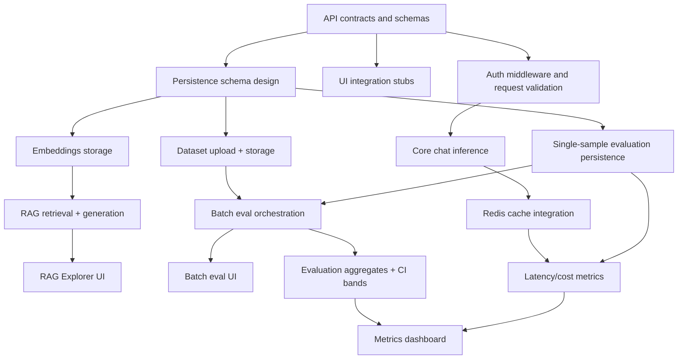

# Implementation Plan

This implementation plan breaks delivery into 1–2 week milestones that align backend contracts, persistence, evaluation, and UI rollout sequencing.

## Delivery milestones (1–2 week increments)

### Milestone 1 (Week 1): Foundations and contracts

**Scope**
- Finalize v1 API contracts for chat, evaluate, embeddings, RAG, datasets, batch eval, auth, and metrics endpoints.
- Set up baseline service skeleton (routing, request validation, error envelopes, request ID propagation).
- Add health/readiness checks for model runtime, persistence layer, and cache layer.
- Create initial OpenAPI or schema artifacts for client generation.

**Acceptance criteria**
- Demo: Backend serves stubbed but schema-valid responses for all required v1 endpoints.
- Required endpoints available:
  - `GET /healthz`
  - `GET /readyz`
  - `POST /v1/chat`
  - `POST /v1/evaluate`
  - `POST /v1/embeddings`
  - `POST /v1/rag/query`
  - `POST /v1/datasets`
  - `POST /v1/batch-evals`
- UI states defined (wireframe/spec level):
  - Loading, success, empty, validation error, unauthorized, and server error states for each major screen.
- Error envelope and status code mapping validated against API contract examples.

---

### Milestone 2 (Week 2): Core inference + auth + cache baseline

**Scope**
- Implement real chat inference path with model adapter and token accounting.
- Implement API key auth middleware and role-based endpoint guards.
- Add Redis-backed request/result caching on hot read paths.
- Introduce baseline metrics instrumentation (latency, token usage, cache hit rate).

**Acceptance criteria**
- Demo: Authenticated user can complete an end-to-end chat request with measurable latency and token stats.
- Required endpoints behavior:
  - `POST /v1/chat` returns model response + latency + token fields.
  - Auth enforced on all non-health endpoints (`401` without key).
  - Cache hit/miss observable in response metadata or metrics endpoint.
- UI states implemented for chat:
  - Auth required state.
  - In-flight generation state.
  - Response rendered with latency/token metadata.
  - Retryable error state for transient failures.

---

### Milestone 3 (Weeks 3–4): Persistence, datasets, and evaluation core

**Scope**
- Implement persistence schema for datasets, eval runs, per-sample results, and run metadata.
- Build dataset upload/validation flow.
- Implement single-sample evaluation endpoint with rubric-compatible scoring schema.
- Add run metadata capture (model params, template version/hash, environment, timestamps).

**Acceptance criteria**
- Demo: User uploads dataset, runs single-sample eval, and sees stored result after page reload.
- Required endpoints behavior:
  - `POST /v1/datasets` validates and persists dataset metadata.
  - `POST /v1/evaluate` persists per-sample scoring outputs.
  - `GET /v1/evals/{run_id}` returns stored run + metadata.
- UI states implemented:
  - Dataset upload progress + validation failure details.
  - Evaluation result view with correctness/faithfulness/hallucination scores.
  - Persisted history list with empty state when no runs exist.

---

### Milestone 4 (Weeks 5–6): RAG pipeline + embeddings integration

**Scope**
- Implement embeddings generation/storage and retrieval index wiring.
- Implement RAG query workflow: retrieve context, generate answer, return evidence payload.
- Add retrieval diagnostics (top-k chunks, similarity scores, citation metadata).
- Validate grounding/faithfulness fields for RAG outputs.

**Acceptance criteria**
- Demo: User queries RAG interface and sees answer with cited retrieved chunks.
- Required endpoints behavior:
  - `POST /v1/embeddings` creates/stores vectors.
  - `POST /v1/rag/query` returns answer, retrieved contexts, and citation metadata.
  - `GET /v1/rag/indexes/{id}` returns index status/summary.
- UI states implemented:
  - Retrieval-in-progress state separate from generation-in-progress state.
  - “No relevant context found” fallback state.
  - Expandable evidence panel showing source chunks and scores.

---

### Milestone 5 (Week 7): Batch evaluation and dashboarding

**Scope**
- Implement batch evaluation orchestration (queue/executor/retry semantics).
- Compute and persist dataset-level aggregates (pass rate, CI bands, failure taxonomy, latency percentiles).
- Build metrics dashboard for service health and evaluation outcomes.
- Add export support for evaluation artifacts and metrics snapshots.

**Acceptance criteria**
- Demo: User launches a batch eval and tracks progress to completion with aggregated outcomes.
- Required endpoints behavior:
  - `POST /v1/batch-evals` creates async batch run.
  - `GET /v1/batch-evals/{run_id}` returns progress, status, and partial/final aggregates.
  - `GET /v1/metrics` exposes operational and evaluation KPIs.
- UI states implemented:
  - Batch queue/queued/running/completed/failed states.
  - Drill-down from aggregate failures into per-sample records.
  - Dashboard with service health banner and key KPI cards.

---

### Milestone 6 (Week 8): Hardening, SLO validation, and release readiness

**Scope**
- Conduct load/stress testing and latency optimization (cache policy tuning, timeout budgets).
- Add operational safeguards (rate limits, circuit breakers, backpressure signals).
- Complete security and observability checks (authz coverage, structured logs, tracing hooks).
- Finalize release checklist and runbook.

**Acceptance criteria**
- Demo: System sustains target throughput under load while keeping error/latency SLOs within thresholds.
- Required endpoints behavior:
  - Rate-limited paths return canonical `429` envelope and headers.
  - Degraded dependencies surface explicit readiness/health degradation.
- UI states implemented:
  - System degraded banner on dashboard.
  - Batch and chat UIs show graceful error messaging for rate limits/timeouts.
  - Final pre-release QA checklist completed and signed off.

## Dependency graph

### Dependency notes
- API contracts are a hard prerequisite for stable frontend/backend integration.
- Persistence must land before batch evaluation UI because batch runs depend on durable job/result records.
- Embeddings and index lifecycle must be complete before full RAG UI behavior can be validated.
- Aggregated eval metrics depend on both per-sample scoring and batch orchestration completion.

## Risk register and mitigations

| Risk | Impact | Likelihood | Early indicators | Mitigation | Contingency |
|---|---|---|---|---|---|
| GPU availability constraints | Delays inference throughput tests and production-like validation. | Medium-High | Queue growth, long warm-up, frequent model cold starts. | Maintain CPU fallback profile; reserve GPU windows in advance; support smaller model class for dev/test. | Shift non-GPU milestones earlier; run reduced-scale eval plan; temporarily lower concurrency targets. |
| Model latency regression | Fails latency SLOs and degrades UX for chat/eval/RAG. | High | p95 spikes, timeout increase, elevated retry rates. | Add latency budgets per stage, cache hot prompts, token caps, and timeout guardrails; track p50/p95 continuously. | Enable degraded mode (reduced max tokens, cached-only paths for selected workflows) while tuning. |
| Cache invalidation errors | Stale or inconsistent responses; trust and correctness issues. | Medium | Mismatched outputs after data/model updates; sudden cache hit anomalies. | Version cache keys by model+prompt-template+dataset/index revision; TTL + explicit invalidation hooks on write paths. | Temporarily disable affected cache namespace; fall back to uncached path while rebuilding keys. |
| Evaluation drift (rubric or evaluator changes) | Historical comparability breaks; KPI trends become unreliable. | Medium | Score distribution shifts not explained by code/model changes. | Pin evaluator version and rubric schema in run metadata; run shadow evaluations before switching scoring logic. | Backfill/recompute impacted runs with previous evaluator; split dashboard trends by evaluator version. |

## Exit criteria for plan completion

- All must-have capabilities from project scope are delivered with passing acceptance scenarios.
- Operational metrics and evaluation metrics are visible in dashboard and exportable.
- Documentation (API contracts, UI behavior, evaluation schema, runbooks) is synchronized with shipped behavior.
